# LAB — день 7

> Скопируйте в `LAB.md` в корне `git-bootcamp-day-7` на **GitHub** и заполните по ходу работы.

## Базовая задача — `01-platforms-tour`

### Ссылки на репозитории

| Платформа | URL |
|-----------|-----|
| GitHub (основной) | [FIXME: https://github.com/.../git-bootcamp-day-7] |
| GitLab | [FIXME] |
| GitFlic | [FIXME] |
| GitVerse | [FIXME] |

### GitLab — скриншоты (3)

1. SSH-ключ в UI:

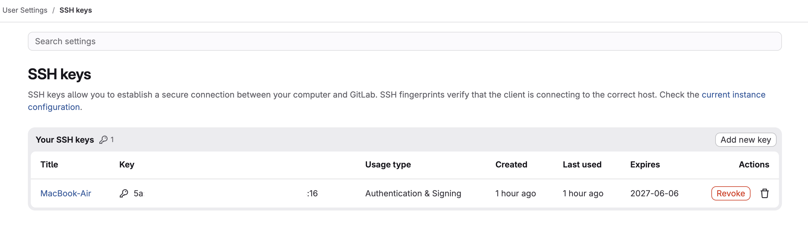

2. Терминал `ssh -T`:

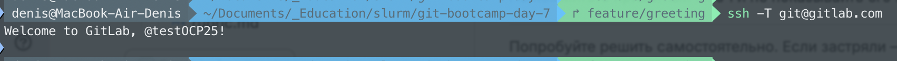

3. Репозиторий после push (ветки + тег):

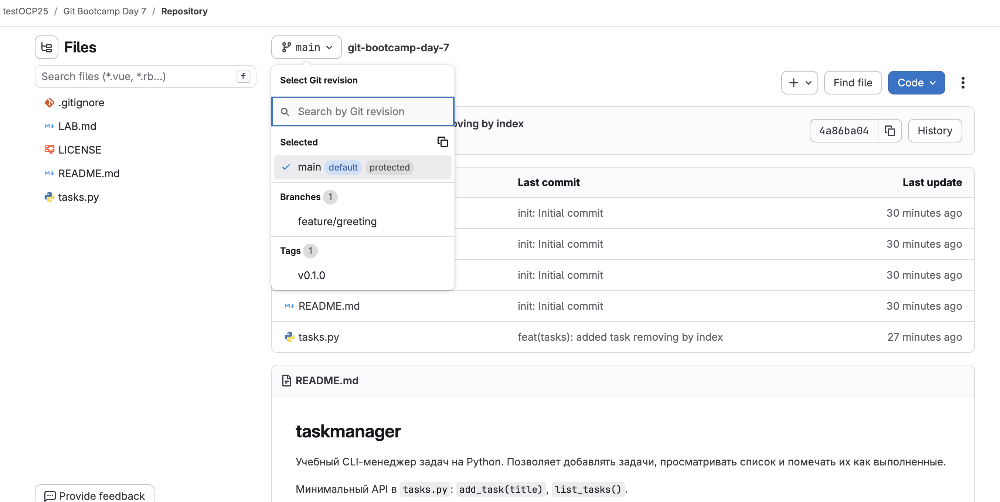

### GitFlic — скриншоты (3)

1. SSH-ключ в UI:


2. Терминал `ssh -T`:

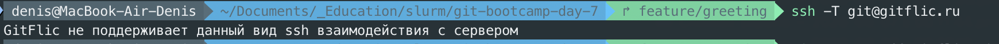

3. Репозиторий после push:

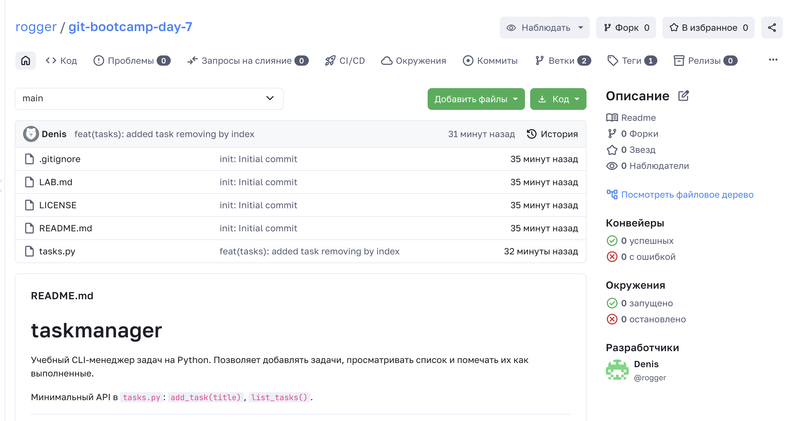

### GitVerse — скриншоты (3)

1. SSH-ключ в UI:

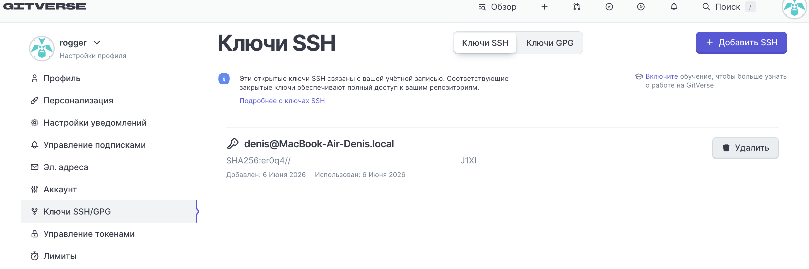

2. Терминал `ssh -T`:

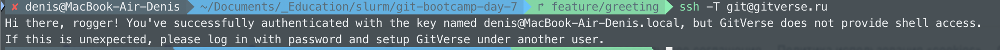

3. Репозиторий после push:

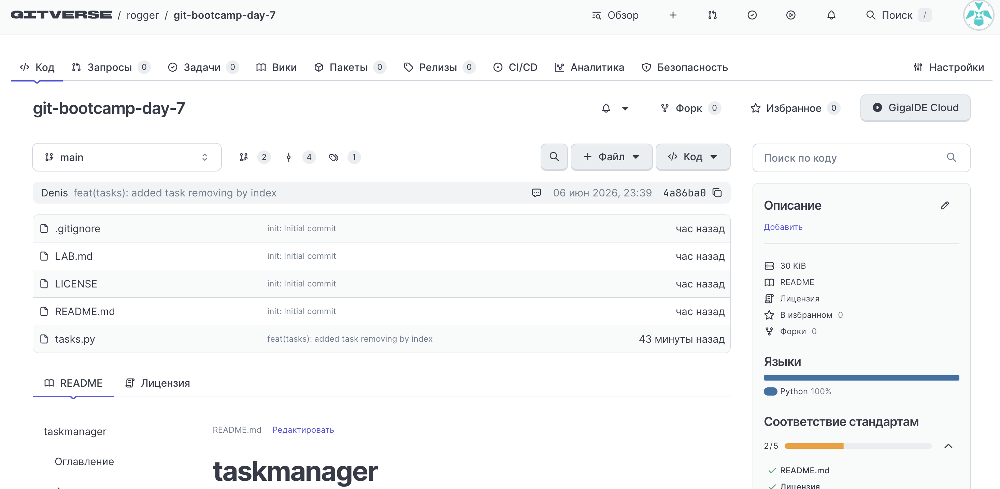

### Таблица сравнения платформ

| Возможность | GitHub | GitLab | GitFlic | GitVerse |
|-------------|--------|--------|---------|----------|
| SSH-ключ через UI | да | [FIXME] | [FIXME] | [FIXME] |
| Markdown render в README | да | [FIXME] | [FIXME] | [FIXME] |
| Issues встроены | да | [FIXME] | [FIXME] | [FIXME] |
| PR / Merge Request | PR | [FIXME] | [FIXME] | [FIXME] |
| Встроенный CI | Actions | [FIXME] | [FIXME] | [FIXME] |
| Релизы / теги в UI | да | [FIXME] | [FIXME] | [FIXME] |
| Видимость для незалогиненных | да | [FIXME] | [FIXME] | [FIXME] |
| Что-то особенное | [FIXME] | [FIXME] | [FIXME] | [FIXME] |

### Команды

```bash
# git remote add gitlab ...
# git remote add gitflic ...
# git remote add gitverse ...
# git push ... --tags
# ssh -T git@gitlab.com
# ssh -T git@gitflic.ru
# ssh -T git@gitverse.ru
```

### Впечатления (2–3 предложения)

[FIXME: что удивило или было неудобно на GitLab / GitFlic / GitVerse]

---

## ⭐1 — bare headless

**Где bare на VM и URL remote `vm`:**

[FIXME: /srv/git/myrepo.git, git@192.168.56.10:...]

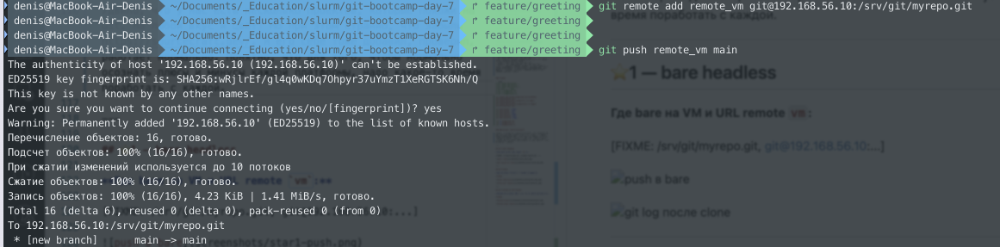

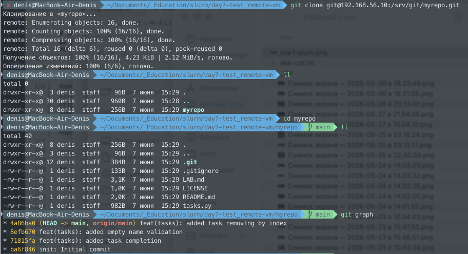

---

## ⭐2 — Gitea

**Чем UI Gitea отличается от GitHub (1 абзац):**

[FIXME]

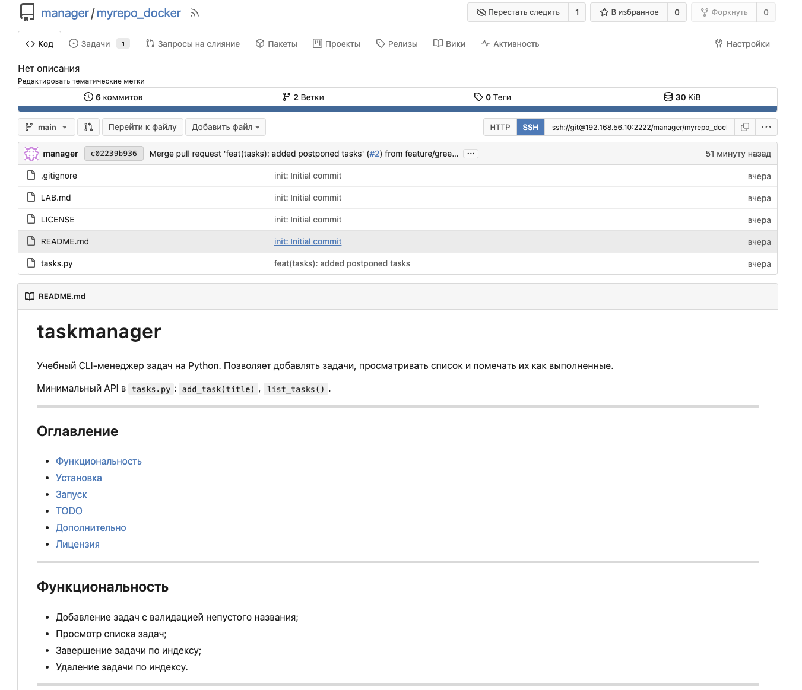

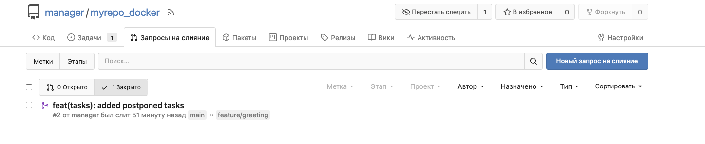

---

## ⭐3 — GitLab CE self-hosted

**GitLab CE vs Gitea: RAM, время старта (2–3 предложения):**

[FIXME]

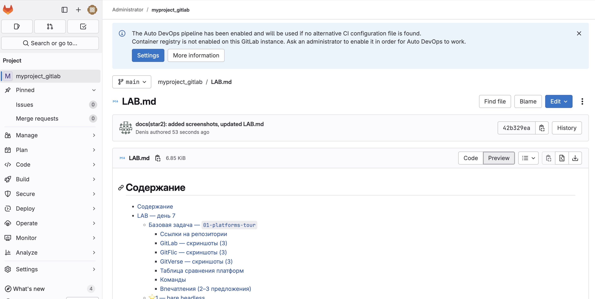

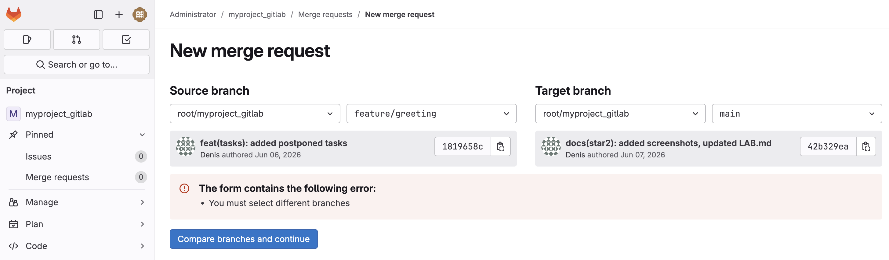
